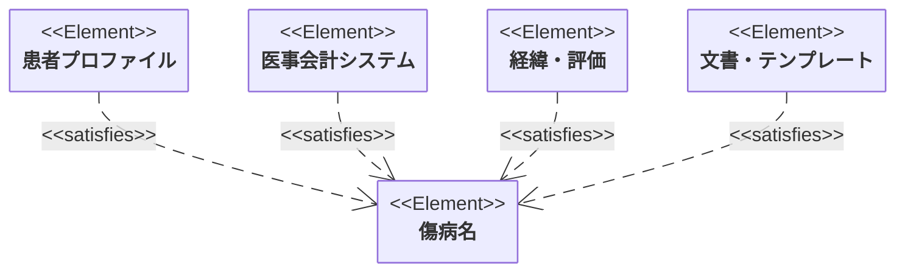

# note

```mermaid
requirementDiagram

  element "傷病名" {
  }

  element "患者プロファイル" {
  }

  element "医事会計システム" {
  }

  element "経緯・評価" {
  }

  element "文書・テンプレート" {
  }

  "傷病名" <- satisfies - "患者プロファイル"
  "傷病名" <- satisfies - "医事会計システム"
  "傷病名" <- satisfies - "経緯・評価"
  "傷病名" <- satisfies - "文書・テンプレート"
```

