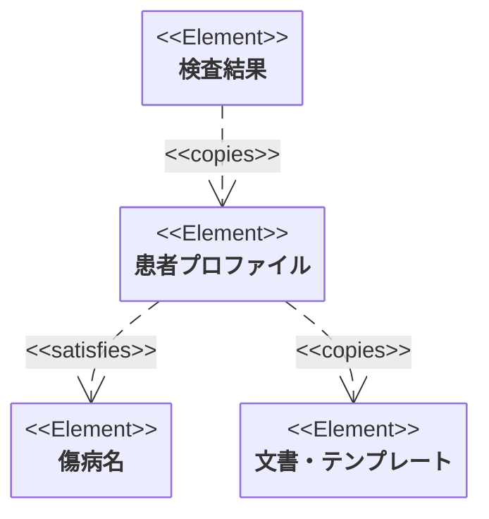

# note

```mermaid
requirementDiagram

  element "患者プロファイル" {
  }

  element "検査結果" {
  }

  element "傷病名" {
  }

  element "文書・テンプレート" {
  }

  "検査結果" - copies -> "患者プロファイル"
  "患者プロファイル" - satisfies -> "傷病名"
  "患者プロファイル" - copies -> "文書・テンプレート"
```

