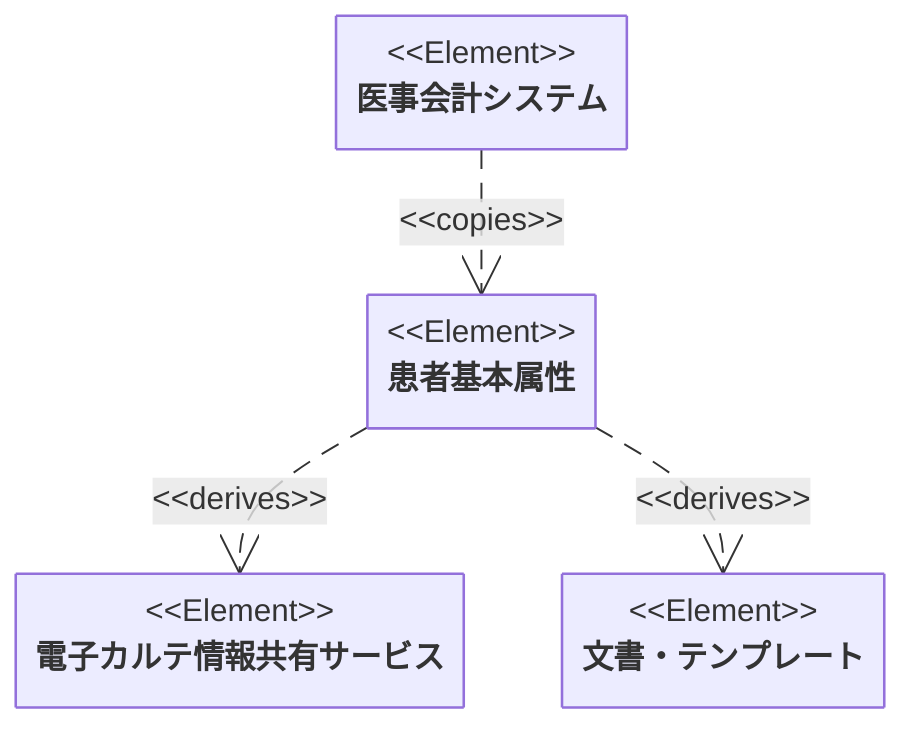

# note

```mermaid
requirementDiagram

  element "患者基本属性" {
  }

  element "医事会計システム" {
  }

  element "電子カルテ情報共有サービス" {
  }

  element "文書・テンプレート" {
  }

  "医事会計システム" - copies -> "患者基本属性"
  "患者基本属性" - derives -> "電子カルテ情報共有サービス"
  "患者基本属性" - derives -> "文書・テンプレート"
```

