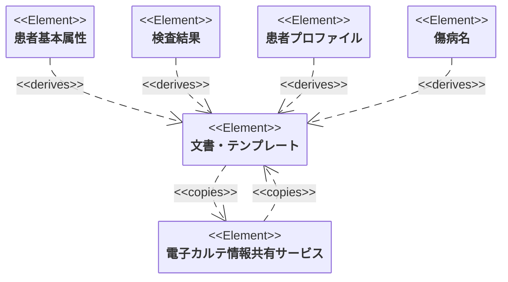

# note

```mermaid
requirementDiagram

  element "文書・テンプレート" {
  }

  element "患者基本属性" {
  }

  element "検査結果" {
  }

  element "患者プロファイル" {
  }

  element "傷病名" {
  }

  element "電子カルテ情報共有サービス" {
  }

  "文書・テンプレート" <- derives - "患者基本属性"
  "文書・テンプレート" <- derives - "検査結果"
  "文書・テンプレート" <- derives - "患者プロファイル"
  "文書・テンプレート" <- derives - "傷病名"
  "文書・テンプレート" - copies -> "電子カルテ情報共有サービス"
  "文書・テンプレート" <- copies - "電子カルテ情報共有サービス"
```

