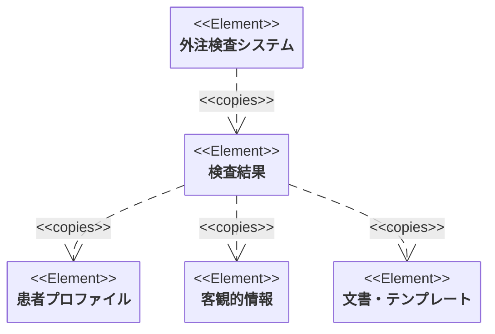

# note

```mermaid
requirementDiagram

  element "検査結果" {
  }

  element "外注検査システム" {
  }

  element "患者プロファイル" {
  }

  element "客観的情報" {
  }

  element "文書・テンプレート" {
  }

  "外注検査システム" - copies  -> "検査結果"
  "検査結果" - copies -> "患者プロファイル"
  "検査結果" - copies -> "客観的情報"
  "検査結果" - copies -> "文書・テンプレート"
```

